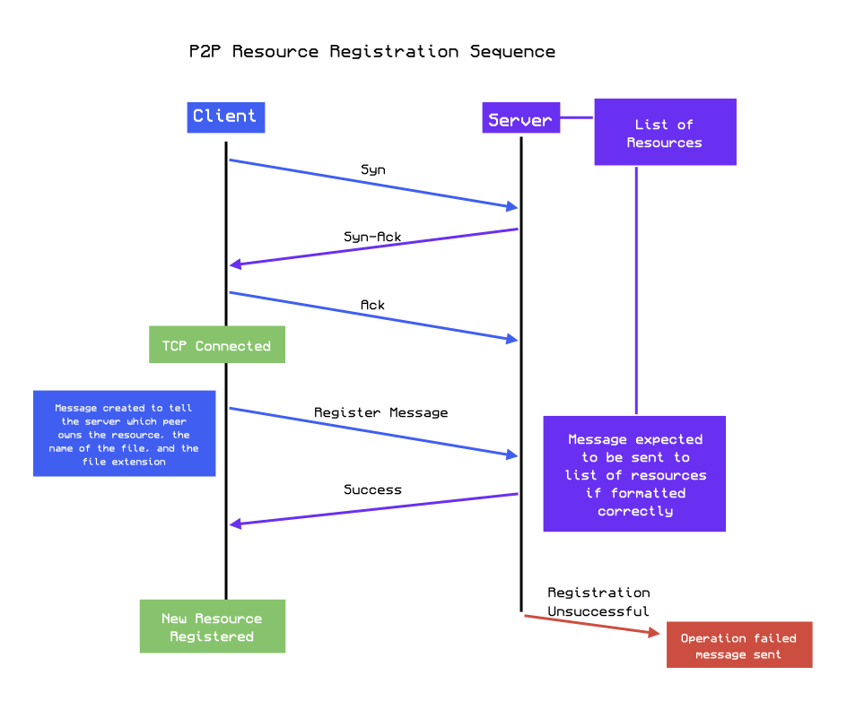

# P2P-File-Sharing

## How to run the code
To run this project, you have to run the following files, ensuring that the tcp_server.py file is run before any clients are spun up:
- tcp_server.py
- tcp_client.py
- second_tcp_client.py
 
After these are all running, you can then log into each client using the following login information (or sign up):  
1. Username: czalpha, Password: D10686712  
2. Username: wdonzcar, Password: sandwich1  
 
From here, you can register files to the netowrk to enable subscription to the files. To subscribe to a file, you must request the file. Once you have requested and received a file, you will have that file synced upon updates to that file. To update the file, you must upload an updated version of that file. To unsubscribe from a file, you can simply press the 'remove synced resource' button. To remove a resource from the index, you can deregister the resource. You can also list all online users, all shared resources, as well as the synced resources you currently possess.

## Architecture
A peer to peer file sharing networking project for our Computer Networking class.

<figure style="text-align:center;">
   

	<figcaption style="font-weight:bold; color:#0055ee;">Figure 1: Network Diagram.</figcaption>
</figure>

# Protocols
Protocol Research & Message Types
In a peer-to-peer (P2P) file-sharing network, different message types allow peers to register, request, and manage shared files. Below, we outline each message type, what it does, and how it is used.

## Message Types & Their Meanings
### R | Resource Registration 
- What it does: Registers a file or resource with the network's index or directory.
- How it's used: When a peer wants to share a file, it sends a registration request to an index server. The server updates its records to include the new resource.

### D | Resource Deregistration
- What it does: Removes a file or resource from the network’s index.
- How it's used: If a peer removes a file from its system, it sends a deregistration request to ensure it is no longer listed for others.

### P | Request Resource Download
- What it does: Requests a specific file from another peer.
- How it's used: A peer sends a download request to another peer that has the file, asking for access to the data.

### G | Get Resource Data
- What it does: Transfers the actual file data from one peer to another.
- How it's used: After acknowledging a download request, the peer sends the requested file’s data over the network.

### L | List of Indexed Resources
- What it does: Provides a list of all available files in the network’s index.
- How it's used: A peer can request this list from an index server to see what files are available for download.

### S | Search Index Server
- What it does: Allows a peer to search for specific files.
- How it's used: A peer sends a search query to the index server, which then returns a list of matching files.

### A | Acknowledge
- What it does: Confirms receipt or successful processing of a request.
- How it's used: When a peer receives a request (e.g., a download request), it sends an acknowledgment to confirm it has been processed.

### E | Error
- What it does: Notifies a peer of a failed operation or issue.
- How it's used: If a request fails (e.g., a file is missing), the peer sends an error message to inform the requester.

## Using TCP for P2P Messages
For communication between peers, we will use TCP (Transmission Control Protocol). TCP ensures reliable, connection-based communication, which is ideal for file sharing. Here’s how each message type is handled using TCP:

### Resource Registration (R): 
A peer sends a TCP message containing file details (e.g., file name, size, and peer ID) to the index server, which then adds the file to its index.

### Resource Deregistration (D):
When a file is removed, the peer sends a TCP message to notify the server, which then updates the index.

### Request Resource Download (P):
A peer sends a request for a file. The server or another peer responds with either an acknowledgment or the file itself.

### Get Resource Data (G):
The requested file is transferred over TCP, possibly in chunks for large files.

### List of Indexed Resources (L):
A peer requests the current list of available files from the server, which sends back the indexed resources.

### Search Index Server (S):
A peer queries the server for specific files, and the server returns a list of matches or a notification if none are found.

### Acknowledge (A):
A simple TCP message is sent to confirm receipt or successful processing of a request.

### Error (E):
If an operation fails, an error message is sent over TCP detailing the issue.

** By using TCP, we ensure a secure and reliable way for peers to communicate, register, search, and transfer files efficiently in the P2P network.

## Diagrams Cont.
<figure style="text-align:center;">
    

	<figcaption style="font-weight:bold; color:#a055ee;">Figure 2: File Transfer Sequence.</figcaption>
</figure>
<figure style="text-align:center;">

	<figcaption style="font-weight:bold; color:#0065ee;">Figure 3: Login Protocol.</figcaption>
</figure>
<figure style="text-align:center;">

	<figcaption style="font-weight:bold; color:#a055ee;">Figure 3: Registration Protocol.</figcaption>
</figure>
<figure style="text-align:center;">

	<figcaption style="font-weight:bold; color:#0065ee;">Figure 4: Deregistration Protocol.</figcaption>
</figure>

### Bigger Diagram Links:

 

 

 

 

 
